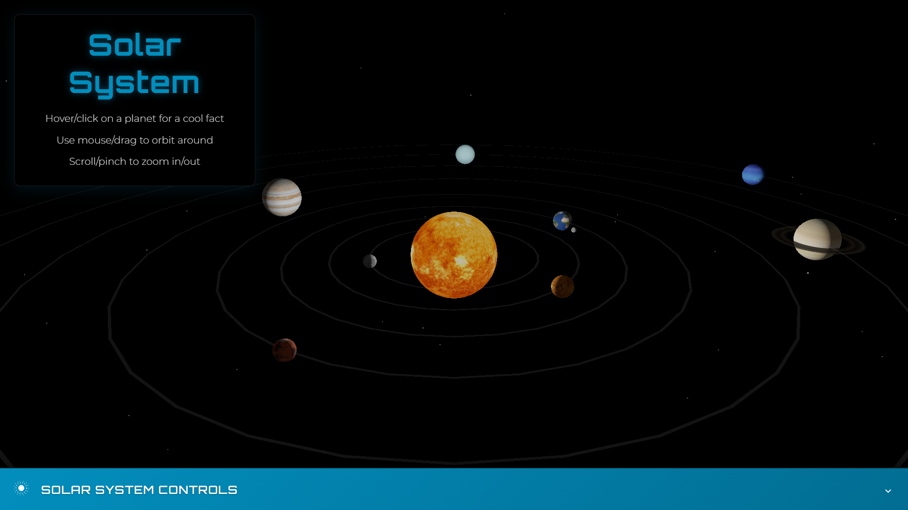

# Interactive 3D Solar System

A visually stunning and interactive 3D solar system simulation built with Three.js. This project features realistic planet textures from NASA, physically accurate orbital mechanics, dynamic lighting effects, and a responsive touch-friendly UI that works seamlessly across desktop and mobile devices.

[**🌐 Live Demo**](https://3d-interactive-solar-system.netlify.app/)



## ✨ Features

- 🪐 **Complete Solar System** - All 8 planets with accurate relative sizes and orbital distances
- 🌙 **Earth's Moon** - Realistic moon with correct orbital mechanics around Earth
- 💍 **Saturn's Rings** - Detailed rendering of Saturn's iconic ring system
- 🔆 **Realistic Lighting** - Sun serves as the main light source with physically-based illumination
- ⚡ **Individual Speed Controls** - Adjust rotation and orbital speed for each planet independently
- 🌠 **Rich Star Background** - Beautiful multi-layered starfield with thousands of stars
- 🖱️ **Interactive Navigation** - Intuitive camera control with orbit, zoom, and pan capabilities
- 📱 **Mobile Optimized** - Responsive design with touch controls and mobile-specific optimizations
- ⚡ **Performance Focused** - Efficient rendering for smooth framerates even on lower-end devices
- 🎛️ **Collapsible UI Panel** - Clean, modern dropdown control panel that stays out of the way
- 💡 **Informative Tooltips** - Hover/tap on planets to display interesting astronomical facts

## 🛠️ Getting Started

### Prerequisites

- Node.js (version 14 or higher)
- npm or yarn

### Installation

1. Clone the repository:
```bash
git clone https://github.com/yourusername/solar-system.git
cd solar-system
```

2. Install dependencies:
```bash
npm install
```

3. Start the development server:
```bash
npm run dev
```

4. Open your browser and navigate to the local server URL shown in the terminal (typically http://localhost:3000)

## 🎮 Controls

### Navigation
- **Mouse Drag / Touch Drag**: Orbit around the solar system
- **Mouse Wheel / Pinch**: Zoom in/out
- **Right-click Drag**: Pan the camera (desktop only)

### UI Panel
- **Bottom Bar**: Click/tap to expand the collapsible control panel
- **Global Speed**: Adjust the overall simulation speed
- **Pause/Resume**: Toggle animation playback
- **Reset**: Restore default speed settings
- **Planet Controls**: Individual speed adjustment for each planet

### Interactions
- **Hover/Tap on Planet**: Display name and interesting fact about the celestial body

## 🏗️ Architecture Overview

The application follows an object-oriented design centered around the `SolarSystem` class, which handles:

1. **Scene Setup**: Creating the Three.js scene, camera, renderer, and lighting
2. **Planet Creation**: Generating geometries, materials, and textures for celestial bodies
3. **Animation Loop**: Managing rotation, revolution, and visual effects
4. **User Interface**: Building and handling the interactive control panel
5. **Event Handling**: Processing mouse/touch events for interactions
6. **Dynamic Adaptations**: Adjusting visuals and performance based on device capabilities

## 📁 Project Structure

```
SolarSystem/
├── src/
│   ├── main.js           # Main Three.js application code
│   ├── styles.css        # CSS styles for UI components
│   └── textures/         # Planet and star textures
│       ├── earth_daymap.jpg
│       ├── jupiter.jpg
│       ├── mars.jpg
│       ├── mercury.jpg
│       ├── moon.jpg
│       ├── neptune.jpg
│       ├── saturn.jpg
│       ├── saturn_rings.png
│       ├── sun.jpg
│       ├── uranus.jpg
│       └── venus.jpg
├── index.html            # HTML entry point
├── package.json          # Dependencies and scripts
├── vite.config.js        # Vite configuration
└── README.md             # Project documentation
```

## 💻 Key Implementation Details

### Solar System Mechanics
- Object-oriented approach with a centralized `SolarSystem` class
- Accurate celestial body positions, sizes, and orbital parameters
- Proper parent-child relationships (Earth-Moon system)
- Physically based rotation and revolution mechanics

### Rendering and Visuals
- Three.js WebGL renderer with optimized settings
- Texture-mapped planet surfaces using NASA imagery
- Ambient and point lighting for realistic illumination
- Dynamic starfield background with thousands of points

### User Interface
- Mobile-first, responsive design principles
- Collapsible bottom dropdown control panel
- Touch-friendly sliders and buttons with proper sizing
- Dynamic tooltip positioning to prevent off-screen rendering

### Performance Optimizations
- Responsive geometry detail based on device capabilities
- Efficient event handling with unified pointer events
- Hardware acceleration with WebGL and Three.js optimizations
- Adaptive rendering quality for mobile devices
- DOM element caching for improved performance

## 🔧 Customization Options

### Planets and Orbits
Modify the planet data in `main.js` to change:
- Planet sizes, distances, and orbital speeds
- Texture mappings and surface details
- Orbit characteristics and inclinations

### Visual Effects
- Adjust star counts and distributions in the `createStarfield()` method
- Modify lighting parameters in the `createSolarSystem()` method
- Change camera settings in the `init()` method

### UI and Controls
- Update styles in `styles.css` to modify the appearance of the control panel
- Adjust event handlers in `setupEventListeners()` to change interaction behavior
- Modify tooltips to display different information

## 📊 Performance Notes

- The application automatically detects device capabilities and adjusts rendering quality
- On mobile devices, geometry complexity is reduced and certain visual effects are simplified
- The control panel is designed to minimize DOM reflows and optimize touch responsiveness
- WebGL context is configured for optimal performance across different device types

## 📜 License

MIT License - Feel free to use this project for learning, personal projects, or as a base for your own Three.js experiments!
